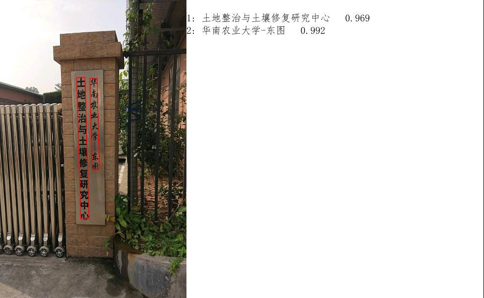
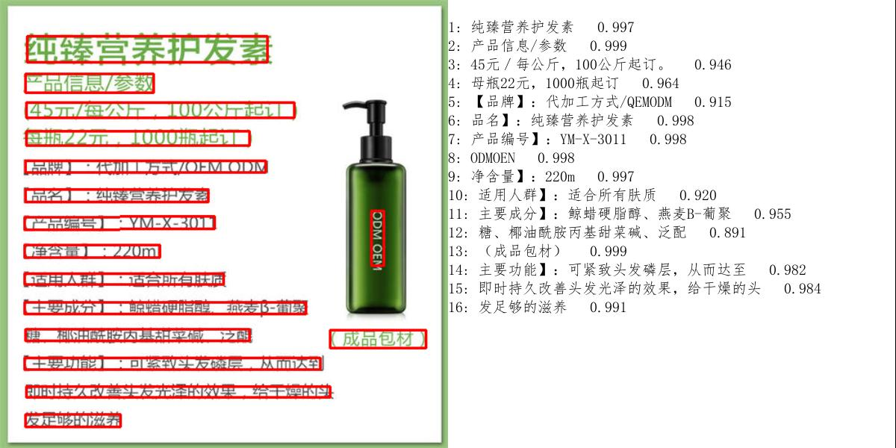
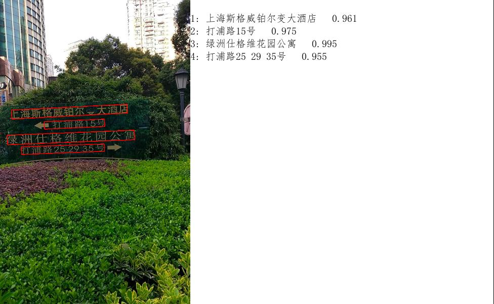
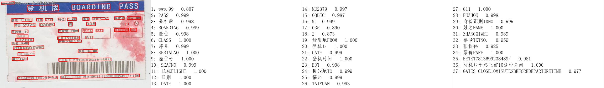
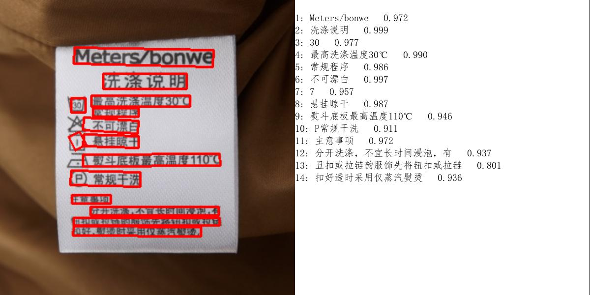

# onnxOCR
####   一.优势：
1.脱离深度学习训练框架，可直接用于部署的通用OCR。
2.在算力有限，精度不变的情况下使用paddleOCR转成ONNX模型，进行重新构建的一款可部署在arm架构和x86架构计算机上的OCR模型。
3.在同样性能的计算机上推理速度加速了4-5倍。

#### 二.环境安装
    python>=3.6

    pip install -i https://pypi.tuna.tsinghua.edu.cn/simple -r requirements.txt

    由于rec模型超过了100M，github有限制，所以我上传到
[百度网盘,提取码: 125c](https://pan.baidu.com/s/1O1b30CMwsDjD7Ti9EnxYKQ )
     
    下载后放到./models/ch_ppocr_server_v2.0/rec/rec.onnx下

#### 三.一键运行

    python test_ocr.py

#### 效果展示

#### 感谢PaddleOcr

https://github.com/PaddlePaddle/PaddleOCR

#### 从该项目Fork而来
https://github.com/jingsongliujing/OnnxOCR

---

CHANGELOG

1. 加入最新的`pp_ocr_v4`的检测与识别模型
2. 修改包名为`pp_onnx`防止与onnx冲突
3. 修改部分写死的参数

